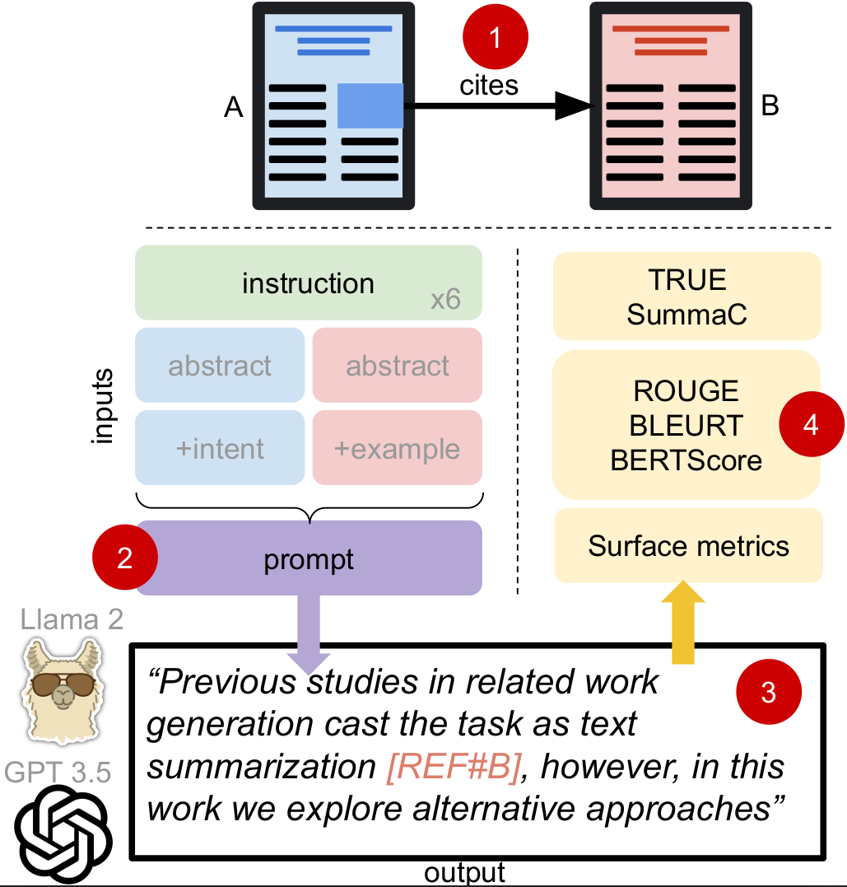

# Systematic Task Exploration with LLMs: A Study in Citation Text Generation

<p align="center">
  
<p align="center">

This repository contains code and resources related to the paper "Systematic Task Exploration with LLMs: A Study in Citation Text Generation", published at main conference ACL 2024.

If you utilize this repository and our work, please cite:

```bibtex
@InProceedings{sahinuc2024citation-text-generation,
  author    = {Furkan \c{S}ahinu\c{c} and Ilia Kuznetsov and Yufang Hou and Iryna Gurevych},
  title     = {Systematic Task Exploration with {LLM}s: A Study in Citation Text Generation},
  booktitle = {The 62nd Annual Meeting of the Association for Computational Linguistics},
  month     = aug,
  year      = {2024},
  address   = {Bangkok, Thailand},
  publisher = {Association for Computational Linguistics},
}
```

> **Abstract:** Large language models (LLMs) bring unprecedented flexibility in defining and executing complex, creative natural language generation (NLG) tasks. Yet, this flexibility brings new challenges, as it introduces new degrees of freedom in formulating the task inputs and instructions and in evaluating model performance. To facilitate the exploration of creative NLG tasks, we propose a three-component research framework that consists of systematic input manipulation, reference data, and output measurement. We use this framework to explore citation text generation -- a popular scholarly NLP task that lacks consensus on the task definition and evaluation metric and has not yet been tackled within the LLM paradigm. Our results highlight the importance of systematically investigating both task instruction and input configuration when prompting LLMs, and reveal non-trivial relationships between different evaluation metrics used for citation text generation. Additional human generation and human evaluation experiments provide new qualitative insights into the task to guide future research in citation text generation.


Contact person: Furkan Şahinuç, [furkan.sahinuc@tu-darmstadt.de](mailto:furkan.sahinuc@tu-darmstadt.de)

https://www.ukp.tu-darmstadt.de/

https://www.tu-darmstadt.de/


Don't hesitate to send us an e-mail or report an issue, if something is broken (and it shouldn't be) or if you have further questions.

## Project Summary

The main objective of this project is to generate related work section paragraphs based on citing-cited paper abstracts, free-form citation intents, and example citation sentences by leveraging Llama-2 Chat and GPT 3.5 Turbo models.

The following codes (1) create the related work dataset based on ACL Anthology Corpus, (2) generate the free-form citation intents, and (3) generate the related work paragraphs by using the properties obtained in previous steps. 

## Project structure

Project structure can be found below. Each script is explained in the following sections.

```
.
├── data-construction
│   ├── cleaning.py
│   ├── corrupted_abstracts.txt
│   ├── extract_cited_papers_for_examples.py
│   ├── extract_rws.py
│   ├── inspect_data.ipynb
│   └── title_duplicate_instances.tsv
├── intent-generation
│   ├── categorical_intent_generation.py
│   ├── configs.py
│   ├── example_intents.tsv
│   ├── generate_intents.py
│   └── model_init.py
├── paragraph-generation
│   ├── auto_eval.py
│   ├── configs.py
│   ├── generate_paragraphs_gpt.py
│   ├── generate_paragraphs_llama.py
│   ├── model_init.py
│   ├── summac_eval.py
│   ├── surface_eval.py
│   ├── system_prompts.json
│   ├── true_eval.py
│   └── utils.py
├── LICENSE
├── logo.png
├── NOTICE
├── README.md
└── requirements.txt

```

## Installation

```
conda create -n citation_text python=3.8
conda activate citation_text
pip install -r requirements.txt
```

For SummaC evaluation, please refer installation in [this page](https://github.com/tingofurro/summac). We strongly recommend to install this package in another virtual environment due to some conflicts with latest version of the other packages.


## Dataset Construction

If you want to build the related work dataset from scratch, you can obtain the raw ACL Anthology corpus along with metadata information from [here](https://github.com/shauryr/ACL-anthology-corpus). Otherwise, you can directly use the dataset that we used in our experiments. It can be reached [here](https://tudatalib.ulb.tu-darmstadt.de/handle/tudatalib/4234). If you make your choice that way, you can skip dataset construction and free-form intent generation parts. 


### Extracting Raw Related Work Paragraphs

```
python dataset_construction/extract_rws.py --acl_corpus_dir /your/path/acl_corpus_grobid_full_text.80k.v9_22.tar.gz --acl_metadata_dir /your/path/acl-publication-info.74k.parquet --output_dir /your/output/path
```

Parameter explanation:

* ```acl_corpus_dir``` 
  * Path or directory to downloaded ACL Anthology corpus

* ```acl_metadata_dir``` 
  * Path or directory to downloaded ACL Anthology metadata file

* ```output_dir``` 
  * Output path for raw related work paragraph file


### Extracting Raw Example Citation Sentences

```
python dataset_construction/extract_cited_papers_for_examples.py --acl_corpus_dir /your/path/acl_corpus_grobid_full_text.80k.v9_22.tar.gz --acl_metadata_dir /your/path/acl-publication-info.74k.parquet --rw_file_dir /raw/related/work/data/path --output_dir /your/output/path
```

Parameter explanation:

Parameters are the same as above except following.

* ```rw_file_dir``` 
  * Path to raw related work paragraph file (Output of extract_rws.py)

### Data Cleaning

```
python dataset_construction/cleaning.py --acl_metadata_dir /your/path/acl-publication-info.74k.parquet --rw_file /raw/related/work/data/path --example_file /raw/example/sentence/data/path --output_dir /your/output/path
```

Parameter explanation:

Parameters are the same as above except following.

* ```example_file``` 
  * Path to raw example sentence file (Output of extract_cited_papers_for_examples.py)


## Intent Generation

### Free-form Intent Generation

You can simply run following command to generate intents with default settings.

```
python intent-generation/generate_intents.py --exp_id "1" --input_file /related/work/dataset/path/ --output_path /your/output/path
```

Parameter explanation:

* ```exp_id``` 
  * Experiment id identifier

* ```model```
  * Huggingface model name. Default model is "google/flan-t5-xxl". Other models will raise exception since it will not generate the same intents (changeable in generate_intent.py). 

* ```num_examples```
  * If intents are generated in few-shot manner, number of example intents to be shown to the model. Default value is 0.

* ```custom_examples```
  * Whether pre-selected intents are used in few-shot setting. Otherwise, randomly ```num_examples``` intents will be selected from "example_intents.tsv" file. Default value is False.

* ```input_file```
  * Related work paragraphs dataset (Output of data-construction/extract_rws.py and cleaning.py or released ```clean_acl_related_work_data.tsv``` file.)

* ```example_file```
  * If intents are generated in few-shot manner, example intent file to be shown the model. Default value is provided as "example_intents.tsv".

* ```output_path```
  * Path for generated outputs.

* ```strategy```
  * Text generation strategy. Default value is "greedy". Other options "sampling, beam, beam_sampling, contrastive". For further information please refer [this page](https://huggingface.co/docs/transformers/v4.28.1/en/main_classes/text_generation#transformers.GenerationMixin). Following parameters can be overridden depending on the strategy.

* ```temperature```
  * Temperature value. Default value is 1.

* ```num_beams```
  * Number of beams in beam search. Default value is 1. 

* ```top_k```
  * Threshold to be sampled the most-k probable words in sampling strategy. Default value is 0.

* ```penalty_alpha```
  * Penalty alpha value in contrastive search strategy. Default value is 0.

* ```num_return_sequences```
  * Number of generated intents for a given paragraph. Default value is 0.

* ```max_input_len```
  * Maximum input length. Default value is 1024.

* ```max_new_tokens```
  * Maximum number of tokens in the output. Default value is 50.

* ```batch_size```
  * Size of batches that will be fed to the model. Default value is 8.


### Categorical Intent Generation

We use Huggingface inference to obtain categorical intents from [MultiCite: Modeling realistic citations requires moving beyond the single-sentence single-label setting](10.18653/v1/2022.naacl-main.137) paper. You can simply run following command to generate intents with default settings. Before running, please adjust API token. 

```
python intent-generation/categorical_intent_generation.py --input_file /related/work/dataset/path/ --output_path /your/output/path
```

Parameter explanation:

* ```model_url```
  * Huggingface model url. Default value is https://api-inference.huggingface.co/models/allenai/multicite-multilabel-scibert

* ```input_file```
  * Related work paragraphs dataset. (Output of data-construction/extract_rws.py and cleaning.py or released ```clean_acl_related_work_data.tsv``` file.) 

* ```output_path```
  * Path for generated outputs.

* ```batch_size```
  * Size of batches that will be fed to the model. Default value is 16.


## Related Work Paragraph Generations

### Llama 2-Chat Generations

You can simply run following command to generate related work paragraph via Llama 2-Chat. Following example utilizes free-form intent and citation sentence examples for prompt type 6 with default settings.

```
python generate_paragraphs_llama.py --exp_id "t-6-i-e" --input_file /related/work/dataset/path/ --example_file /example/citation/sentence/data/path/ --intent_file /intent/data/path/ --model_path /path/to/llama2/weights/ --output_path /your/output/path/ --prompt_type "type-6"  --use_intent --use_example
```

Parameter explanation:

* ```exp_id```
  * Experiment id identifier

* ```input_file```
  * Related work paragraphs dataset. (Output of data-construction/extract_rws.py and cleaning.py or released ```clean_acl_related_work_data.tsv``` file.) 

* ```example_file```: Example citation sentence dataset. (Output of data-construction/extract_cited_papers_for_examples.py and cleaning.py or released ```clean_acl_rw_example_sentences.tsv``` file.)

* ```intent_file```: Generated intent dataset. (Output of intent-generation/generate_intents.py or released ```intentions.tsv``` file.)

* ```categorical_intent_file```: Generated intent dataset. (Output of intent-generation/categorical_intent_generation.py or released ```categorical_intentions.tsv``` file.)

* ```output_path```
  * Path for generated outputs.

* ```model_type```
  * Model type name. Default value is "llama-2".

* ```model_path```
  * Path to the Llama-2 Chat weights. They should be compatible with Huggingface framework. 

* ```num_examples```
  * Number of example citation sentences to be used in generation. Default value is 1.

* ```prompt_file```
  * File including prompts that we used in experiments. Default value is provided as "system_prompts.json".

* ```prompt_type```
  * ID of the prompt templates in "system_prompts.json". It should be like "type-x" where x is the template number.

* ```citation_limit```
  * Desired maximum citation count in the related work paragraphs. For example, if it is set as 3, paragraphs with less than 4 (≤3) citations will be considered. Default value is 1.

* ```use_example```
  * Flag for whether example citation sentences will be used.

* ```use_intent```
  * Flag for whether intents will be used.

* ```categorical_intent```
  * Flag for whether categorical intents will be used.

* ```selection_mode```
  * Example citation sentence selection strategy. Default value is "topk". Other option is "random".

* ```max_new_tokens```
  * Maximum number of tokens in the output. Default value is 250.

* ```seed```
  * Seed value for reproducibility. Default value is 0.

* ```batch_size```
  * Size of batches that will be fed to the model. Default value is 8.

### GPT-3.5 Turbo Generations

You can simply run following command to generate related work paragraph via GPT-3.5 Turbo. Following example utilize free-form intent and citation sentence examples for prompt type 6 with default settings.

```
python generate_paragraphs_gpt.py --env_file_path /your/API/key/file/ --exp_id "t-6-i-e" --input_file /related/work/dataset/path/ --example_file /example/citation/sentence/data/path/ --intent_file /intent/data/path/ --model_path /path/to/llama2/weights/ --output_path /your/output/path/ --prompt_type "type-6"  --use_intent --use_example
```

Parameter explanation:

Parameters are the same as above except following.

* ```env_file_path```
  * Path of .env file including OpenAI API key and endpoints.

* ```model_type```
  * Model type name. Default value is "gpt".

* ```model_path```
  * Model specification for GPT releases. Default value is "gpt-35-turbo-0613-16k". 

## Evaluation

### Conventional Metrics

This evaluation code measures the performance of outputs for ROUGE, BERTScore and BLEURT.

```
python paragraph-generation/auto_eval.py --dataset_path /related/work/dataset/path/ --model_output_path /generated/paragraphs/path/ --eval_results_path /path/for/average/results/ --eval_values_path /path/for/each/value/ --bleurt_checkpoint /BLEURT/checkpoint/path/ --clean_output
```

Parameter explanation:

* ```dataset_path```
  * Related work paragraphs dataset. (Output of data-construction/extract_rws.py and cleaning.py or released ```clean_acl_related_work_data.tsv``` file.)
  
* ```model_output_path```
  * Path to generated paragraphs to be evaluated. (Output of generate_paragraphs_llama.py or generate_paragraphs_gpt.py) 

* ```eval_results_path```
  * Path to json file where average results will be saved.

* ```eval_values_path```
  * Path to json file where individual results for each instance will be saved.

* ```bleurt_checkpoint```
  * BLEURT checkpoint path. We use [BLEURT-20](https://storage.googleapis.com/bleurt-oss-21/BLEURT-20.zip) in our measurements. For other checkpoints please refer [this page](https://github.com/google-research/bleurt/blob/master/checkpoints.md).

* ```clean_output```
  * Flag for removing starting part (e.g., 'Sure! Here's the related work paragraph.') in answer of the model from the output.

### TRUE

This evaluation code measures the performance of outputs for TRUE framework. 

```
python paragraph-generation/true_eval.py --dataset_path /path/to/related/work/dataset/ --model_output_path /generated/paragraphs/path/ --eval_results_path /path/for/average/results/ --eval_values_path /path/for/each/value/ --clean_output
```

Parameter explanation: Parameters are the same as previous measurement.

### SummaC

This evaluation code measures the performance of outputs for SummaC framework.

```
python paragraph-generation/summac_eval.py --dataset_path /path/to/relaed/work/dataset/ --model_output_path /generated/paragraphs/path/ --eval_results_path /path/for/average/results/ --eval_values_path /path/for/each/value/ --clean_output
```

Parameter explanation: Parameters are the same as previous measurement.

### Surface Measurements

This evaluation code implements the surface measurements. 

```
python surface_eval.py --dataset_path /path/to/relaed/work/dataset/ --model_output_path /generated/paragraphs/path/ --eval_results_path /path/for/average/results/ --eval_values_path /path/for/each/value/ --clean_output
```

Parameter explanation: Parameters are the same as previous measurement.

## Disclaimer

This repository is published for the sole purpose of giving additional background details on the respective publication.
  
